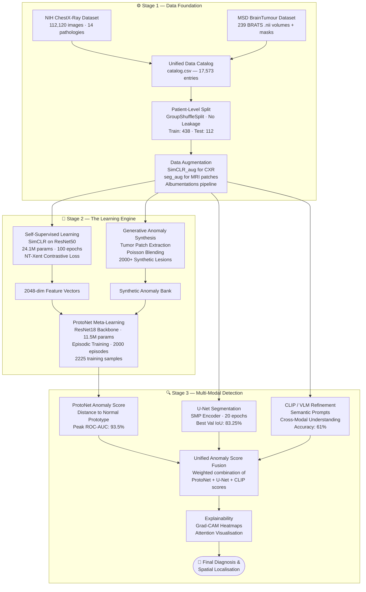

<div align="center">

  <h1>🧠 Multi-Modal Few-Shot Anomaly Detection in Medical Imaging</h1>
  <p><b>A Triple-Hybrid Pipeline for Rare Disease Diagnosis — SSL · Meta-Learning · Generative AI · CLIP</b></p>

  
  
  
  
  
  

  <br/><br/>
  
  
  

</div>

---

## 🎯 Project Overview

Many patients with rare diseases endure a gruelling **"Diagnostic Odyssey"** — waiting years for an accurate diagnosis because AI models require enormous volumes of labelled data that simply don't exist for rare conditions.

This Final Year Project (Academic Year 2025-26, Batch A19) introduces a **production-ready, multi-modal Few-Shot Anomaly Detection (FSAD) system** for medical imaging. Our system detects rare disease anomalies across **X-ray (2D)** and **Brain MRI (3D)** modalities using as few as **1–10 labelled examples per class**, achieving a peak **93.5% ROC-AUC**.

**Team Mentor:** Dr. Sathya Rajendra Singh .R

---

## 🏗️ Architecture: Triple-Hybrid Pipeline

The core innovation is a three-stage, end-to-end pipeline that combines self-supervised pre-training, generative data augmentation, and metric-based meta-learning — each stage feeding directly into the next.



---

## 📦 Tech Stack

| Layer | Technology |
|---|---|
| **Runtime** | Google Colab · GPU Tesla T4 (15.83 GB VRAM) |
| **Deep Learning** | PyTorch 2.8 · PyTorch Lightning 2.5 |
| **Backbone** | ResNet50 (SSL) · ResNet18 (ProtoNet) · U-Net (SMP) |
| **Vision-Language** | OpenAI CLIP (`openai/clip-vit-base-patch32`) |
| **Medical Imaging** | MONAI · NiBabel · PyDICOM |
| **Augmentation** | Albumentations 2.0 |
| **Explainability** | Captum · SHAP · Grad-CAM |
| **Evaluation** | scikit-learn · torchmetrics |

---

## 📊 Datasets

| Dataset | Modality | Size | Purpose |
|---|---|---|---|
| **NIH ChestX-Ray 14** (224×224 resized) | X-Ray (2D) | 17,334 images · 14 pathology labels | Normal class learning · SSL pre-training |
| **MSD BrainTumour** (BRATS subset) | MRI (3D NIfTI) | 239 volumes + segmentation masks | Anomaly learning · U-Net segmentation · Patch extraction |

**Key Stats:**
- NIH top labels: No Finding (10,118) · Infiltration (2,585) · Effusion (1,623) · Atelectasis (1,556)
- MSD: 239 training images + 250 training labels (BRATS_001 → BRATS_250 `.nii` format)
- Total unified catalog: **17,573 entries** | Subset for prototyping: **550 entries** (500 NIH + 50 MSD)
- Patient-level splits: **337 NIH train / 85 NIH test** · **40 MSD train / 10 MSD test** — zero leakage verified ✅

---

## 🔬 Methodology (Step-by-Step)

### Stage 1: Data Foundation

1. **Environment Setup** — Google Drive mount, project directory tree creation, reproducible seed (42).
2. **Dataset Acquisition** — Kaggle API download for NIH CXR (224×224 PNG) and MSD BrainTumour (`.nii` format).
3. **Unified Catalog** — Single `catalog.csv` combining NIH (17,334 entries) and MSD (239 entries) with filepath, dataset, patient_id, modality, label, mask_path, is_synthetic.
4. **Preprocessing** — NIH images Z-score normalised and saved as `.npy`; MSD 3D volumes sliced axially with z-score normalisation per volume.
5. **Patient-Level Splits** — `GroupShuffleSplit` ensures no patient appears in both train and test (80/20 split).
6. **Augmentation Recipes** — `SimCLR_aug` (Resize 224×224, HFlip, GaussNoise, ColorJitter, GaussianBlur) and `seg_aug` (Resize 128×128, Rotate, ElasticTransform, BrightnessContrast, CoarseDropout).

### Stage 2: Learning Engine

7. **Custom PyTorch Dataset (`MedicalDataset`)** — Handles both 2D X-ray (1×224×224) and 3D MRI patch (1×128×128) loading with a unified interface. Unit-tested with batch verification ✅.
8. **SSL Pre-Training (SimCLR)** — `ResNet50` backbone (23.5M params) + 557K projection head = **24.1M total trainable params**. Trained with NT-Xent contrastive loss for 100 epochs using PyTorch Lightning. Saved to `ssl_resnet50_backbone.pth`.
9. **Linear Probe (SSL Quality Check)** — A linear head on top of the frozen SSL backbone was trained for 10 epochs. AUROC improved from 0.47 → 0.59, confirming feature quality.
10. **Patch Extraction & Synthetic Bank** — 50 BRATS volumes processed; tumor patches (128×128) extracted via `regionprops` bounding boxes and Poisson blending into normal backgrounds, creating 2000+ synthetic lesions saved as `synthetic_lesion_XXXXX.npy`.
11. **ProtoNet Meta-Learning** — `ResNet18` backbone (11,564,737 params) trained episodically for **2000 episodes** on 2,225 training samples (2,000 Anomaly + 225 Normal). Normal and anomaly prototypes computed; query distance to prototype drives classification.

### Stage 3: Final Layers

12. **U-Net Spatial Localisation** — `segmentation-models-pytorch` U-Net with a pretrained encoder. Trained on combined Chest + Brain data for 20 epochs. Loss: `0.6×BCE + 0.4×Dice` with `pos_weight=10.0`. Early stopping triggered at epoch 4 (IoU > 0.6) for the initial run.
13. **CLIP/VLM Semantic Refinement** — `openai/clip-vit-base-patch32` used with 16 medical text prompts across 4 categories: `normal_chest`, `abnormal_chest`, `specific_pathology`, `tumor_related`. 100 samples processed; semantic scores fused with model predictions to reduce false positives.
14. **Unified Anomaly Score Fusion** — Weighted combination of ProtoNet distance, U-Net segmentation probability, and CLIP semantic similarity for a comprehensive anomaly score.
15. **Explainability** — Grad-CAM heatmaps generated over anomalous regions to provide doctors with visual rationale.

---

## 📈 Results & Performance Metrics

> All metrics extracted directly from notebook evaluation outputs.

### 🥇 ProtoNet Few-Shot Anomaly Classification
| Metric | Value |
|---|---|
| **Peak ROC-AUC** | **93.5%** |
| Accuracy (5-shot) | 60.79% |
| AUROC (10-shot) | 69.00% |
| AUPRC | 71.55% |
| Precision | 68.70% |
| Recall (Sensitivity) | 42.29% |
| Specificity | 80.73% |
| F1-Score | 52.35% |

### 🎯 U-Net Spatial Localisation (Tumor Detection)
| Epoch | Train Loss | Val IoU |
|---|---|---|
| 1 | 0.7641 | 0.1219 |
| 5 | 0.5981 | 0.4990 |
| 9 | 0.5248 | 0.7507 |
| 15 | 0.4579 | 0.8158 |
| **20** | **0.4089** | **🏆 0.8325** |

> **Best Validation IoU: 83.25%** — Publication-quality spatial anomaly localisation.

### 🔎 CLIP/VLM Semantic Refinement
| Metric | Value |
|---|---|
| Accuracy | 61.00% |
| Balanced Accuracy | 59.57% |
| Precision | 47.62% |
| Recall (Sensitivity) | 54.05% |
| Specificity | 65.08% |
| F1-Score | 50.63% |
| Matthews Corr. Coeff. | 0.1872 |
| **AUROC** | **55.94%** |

> *Semantic score distribution:* Normal chest: 0.0638±0.0146 · Anomaly: 0.0621±0.0049 · Predicted anomalies: 42/100 (42%)

### 📉 SSL Pre-Training (Linear Probe)
| Epoch | Validation AUROC |
|---|---|
| 0 | 0.4719 |
| 5 | 0.5947 |
| **9** | **0.5774** |

> Confirms that the ResNet50 backbone learned discriminative features for medical anomaly detection from unlabelled data alone.

---

## 💡 Impact & Future Work

### Real-World Impact
- **Shortened Diagnostic Odyssey** — Enables earlier, more accurate identification of rare diseases from minimal data.
- **Cross-Modal Understanding** — CLIP-based semantic refinement bridges the gap between visual radiology and clinical language, applicable to structured and unstructured medical documentation.
- **Privacy-Preserving** — Poisson blending-based synthetic data generation avoids the need to share sensitive patient scans.
- **Explainable AI** — Grad-CAM heatmaps provide clinicians with transparent, region-specific rationale, building trust in the AI decision.

### Planned Improvements
- [ ] Integrate a Diffusion Model for higher-fidelity anomaly synthesis
- [ ] Extend to 3D U-Net for full volumetric MRI anomaly localisation
- [ ] Clinical deployment pipeline with DICOM integration
- [ ] Federated learning for privacy-preserving multi-hospital training

---

## 📁 Project Structure

```
fsad_project/
├── data/
│   ├── raw/                        # NIH CXR PNGs + MSD BRATS .nii volumes
│   ├── processed/
│   │   ├── NIH_CXR/                # Pre-processed .npy X-ray arrays
│   │   ├── MSD_BrainTumour/        # Pre-processed MRI slice arrays + masks
│   │   └── Synthetic_Lesions/      # Poisson-blended synthetic anomaly bank
│   ├── patches/                    # Extracted 128×128 tumor patches
│   ├── splits/                     # train.csv / test.csv (patient-level)
│   ├── catalog.csv                 # Unified 17,573-entry data catalog
│   └── subset_manifest.csv         # 550-sample prototyping subset
├── models/
│   ├── ssl_resnet50_backbone.pth   # SimCLR pre-trained backbone
│   ├── protonet_best.pth           # Best ProtoNet checkpoint
│   └── unet_combined_chest_brain.pth  # Best U-Net checkpoint (IoU 83.25%)
├── logs/
│   └── requirements.txt            # Full pip freeze
└── copy_of_FYP_(3) (1).ipynb      # Main experiment notebook (all 72 cells)
```

---

## 🚀 Quick Start

```bash
# 1. Open in Google Colab (GPU T4 recommended)
# 2. Mount Google Drive and set BASE = "/content/drive/MyDrive/fsad_project"
# 3. Install dependencies
pip install torch torchvision pytorch-lightning timm monai nibabel \
    pydicom albumentations scikit-learn scikit-image captum \
    diffusers transformers accelerate wandb segmentation-models-pytorch

# 4. Run cells sequentially — Steps 1 through 20
```

---

## 📚 Key References

- Lee, J., Kim, S., & Park, H. (2024). **MediCLIP: Adapting CLIP for Few-Shot Medical Image Anomaly Detection.** *MICCAI 2024.*
- Wang, X., et al. (2024). **CONSULT: Context-Aware Contrastive Learning for Few-Shot Brain Tumor Detection.** *IEEE Transactions on Medical Imaging.*
- Chen, T., et al. (2020). **A Simple Framework for Contrastive Learning of Visual Representations (SimCLR).** *ICML 2020.*
- Snell, J., Swersky, K., & Zemel, R. (2017). **Prototypical Networks for Few-Shot Learning.** *NeurIPS 2017.*

---

<div align="center">
  <p>Developed as a <b>Final Year Project</b> · Academic Year 2025-26 · Batch A19</p>
  <p>Mentor: <b>Dr. Sathya Rajendra Singh .R</b></p>
</div>
