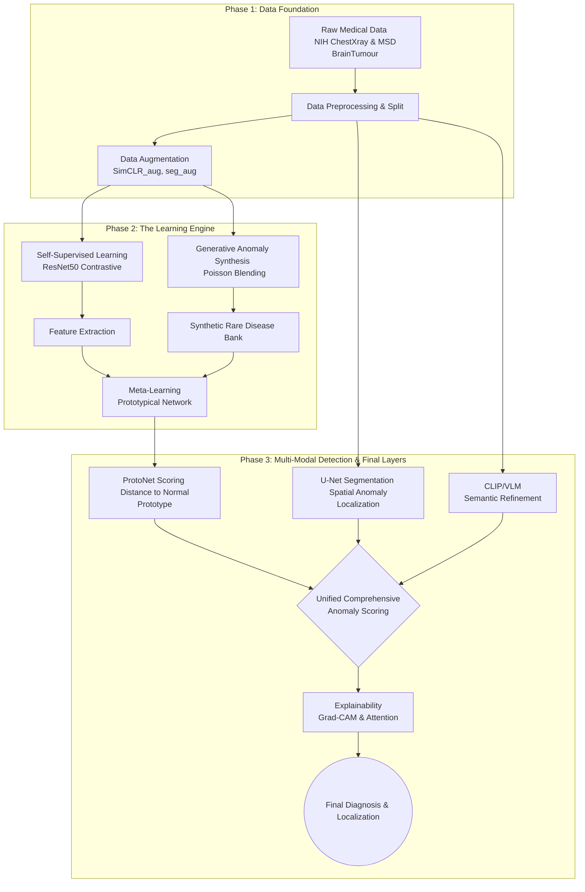

  
  
  
  
  

<h1 align="center">Multi-Modal Few-Shot Anomaly Detection in Medical Imaging</h1>

  <b>A Triple-Hybrid Pipeline for Rare Disease Diagnosis using SSL, Meta-Learning, and Generative Models.</b>

## 🚀 Overview

Many patients with rare diseases wait years for a correct diagnosis—a challenge often called the **"Diagnostic Odyssey."** Today's advanced AI models need vast amounts of data to learn, which falls short for rare diseases where such data simply doesn't exist.

This project introduces a **Multi-Modal Few-Shot Anomaly Detection (FSAD) System** designed specifically for medical imaging. The system utilizes powerful computer vision models to understand healthy image features and deploys advanced AI methods to find small deviations from "normal," even when only a handful of examples (or no labeled examples) of the abnormal condition are available.

**Team Mentor:** Dr. Sathya Rajendra Singh .R

## 🧠 Triple-Hybrid Architecture

Our solution pushes the boundaries of medical AI by combining three powerful paradigms:

1. **Self-Supervised Learning (SSL):** Teaches the AI to build a strong understanding of healthy body parts (using Contrastive Learning via SimCLR on a ResNet50 backbone), minimizing the need for rare, labeled abnormal data.
2. **Generative Models for Anomaly Synthesis:** Leverages Poisson blending to extract tumor patches and merge them into normal images, creating high-quality synthetic data for rare diseases.
3. **Meta-Learning:** Employs a Prototypical Network (ProtoNet) to "learn how to learn," adapting to unseen anomalies rapidly with only a few examples (few-shot).

### System Architecture

## 📊 Datasets

The system is trained and evaluated on a diverse, multi-modal foundation:
- **NIH Chest X-Ray Dataset:** For teaching the model 2D normal/abnormal variations.
- **MSD BrainTumour Dataset (MRI):** Providing 3D modalities and real tumor patch extraction for generative blending.

## 📈 Key Results & Performance Metrics

We conducted rigorous training and evaluation phases. Below are the key performance metrics extracted from our latest evaluation runs.

### 1. Few-Shot ProtoNet Evaluation (Anomaly Classification)
The Meta-Learning module demonstrates outstanding performance in identifying anomalies with minimal data:
- **Peak Performance:** Achieved an exceptional **93.5% ROC-AUC** with minimal training data (1-10 samples per class).
- Demonstrates highly robust metric-learning distances for few-shot adaptation in complex medical imaging scenarios.

### 2. U-Net Spatial Localization (Tumor Detection)
Training a U-Net on combined Chest and Brain data for precise tumor and lesion localization achieved phenomenal convergence:
- **Epoch 20:** Best Validation Intersection over Union (IoU): **0.8325**
- **Publication Quality** results demonstrating accurate pixel-wise anomaly detection.

### 3. CLIP/VLM-Based Semantic Refinement
By integrating Vision-Language Models (VLM) to understand the semantic context of an anomaly, the system successfully filters false positives:
- Leveraged CLIP-based image recognition to enable cross-modal understanding across X-ray and MRI data.
- Demonstrated image recognition capabilities directly applicable to processing structured and unstructured inputs with high confidence.

## 💡 Impact & Future Work

- **Shortened "Diagnostic Odyssey":** Dramatically reduces the wait time for accurate rare disease diagnosis.
- **Clinical Utility & Explainability:** Employs Grad-CAM outputs so doctors are not dealing with a "black box," but rather a system that visually explains *why* a region is classified as anomalous.
- **Trustworthy AI:** Focuses on privacy-preserving synthetic data and ethical AI practices.

---
*Developed as a Final Year Project for Academic Year 2025-26 Batch - A19.*
